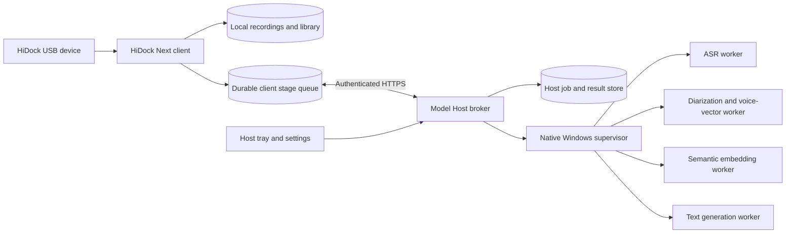
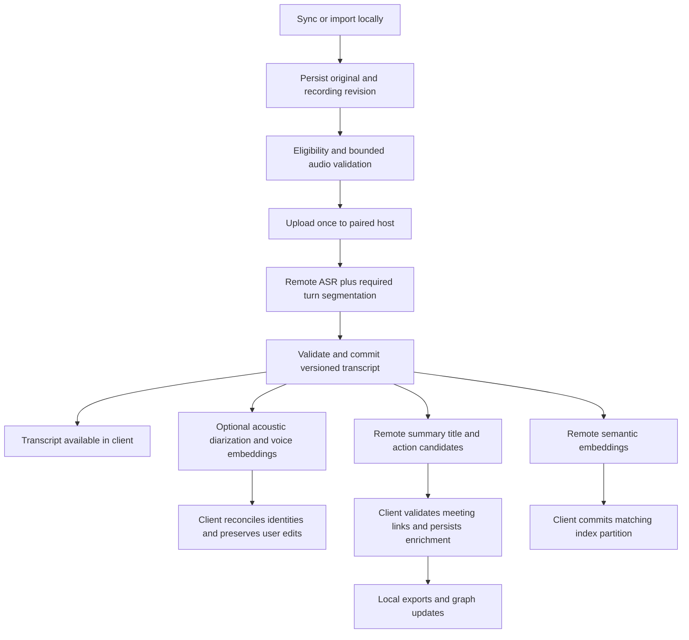

# Native Windows Model Host and Remote Audio Pipeline

Status: **implementation specification — not implemented or deployment-verified**  
Version: 1.0 · 2026-09-17  
Companion evidence: [measured critical path](2026-09-17-critical-path.md)

## 1. Product decision and boundaries

**HiDock Model Host** is a separately installed Windows tray application. HiDock Next remains the
library/device client. The client sends authorized model jobs to the host, receives durable results,
and continues operating when the host is paused, stopped, asleep or unreachable.

The first target is Windows 11 x64 on the user's RTX 4090 / Ryzen 9950-class / 64 GB machine. Hardware
names supplied by the user are descriptive, not capability checks. Installation detects actual devices,
available RAM, logical CPUs, driver/runtime compatibility and free disk space.

Normative terms: **MUST** is a release requirement; **SHOULD** permits a documented exception; **MAY** is optional.

| ID | Requirement |
| --- | --- |
| P01 | Ordinary installation MUST NOT require WSL, Docker, Git, a system Python, npm or terminal commands. |
| P02 | Start, Pause, Stop and Exit MUST have visible, distinct effects; Stop/Exit release model GPU memory and terminate owned model workers. |
| P03 | Remote-only mode MUST NOT fall back to local inference or another paid provider without a separate explicit user choice. |
| P04 | Host unavailability MUST NOT block client startup, USB management, library navigation, playback, editing or ordinary local search. |
| P05 | Reconnection MUST reconcile existing jobs rather than submit duplicates. |
| P06 | A usable transcript MUST survive failures in summaries, identity enrichment, wiki export or embeddings. |
| P07 | Resource budgets apply across all owned model workers, not independently per engine. |
| P08 | Neither install nor update may overwrite the existing HiDock client profile, library, recordings or API keys. |

V1 supports one selected host per client and multiple paired clients per host. LAN is the initial
network assumption; manual hostnames/IPs and private VPN addresses use the same authenticated protocol.
Public internet hosting, router port forwarding, automatic Wake-on-LAN, multi-host scheduling and
automatic game detection are outside V1. Docker/WSL may later implement the same protocol as advanced deployments.

## 2. What exists and what changes

Current code findings, inspected in `G:\Code\hidock-next-2`:

- `apps/electron/electron/main/services/transcription.ts`: audio preflight → local speaker-linking →
  provider transcription → timestamp quality checks → analysis → transcript persistence → additional
  enrichment/export/indexing. Transcription results remain in memory while summary analysis runs.
- `apps/electron/resources/speaker-linking/worker.py`: chooses CUDA if available, otherwise CPU;
  decodes audio and runs pyannote. This backend switch does not constitute a shared resource budget.
- `apps/electron/electron/main/services/speaker-linking.ts`: starts a local Python worker and applies
  a timeout. Cross-recording voice matching and its provenance live in the client.
- Local ASR and VibeVoice adapters in `transcription.ts` start external Python runners. VibeVoice
  configuration includes a CUDA device preference. They do not yet target a remote host.
- Local embedding initialization was moved into an isolated worker during the preceding incident work.
  That is useful containment, but it is neither this host protocol nor a global model resource governor.
- Existing `processing_runs` records and queue APIs are useful migration surfaces, but a recorded
  output reference is not proof that the corresponding transcript was durably committed.
- `apps/electron/electron-builder.yml` already packages the client using NSIS. The host will have a
  separate product identity, installer, update channel and profile.

This specification replaces the assumption that a chosen GPU model may simply run on the client's CPU.
Hardware changes MUST trigger capability re-evaluation before new work starts.

## 3. Ownership and process architecture



**Client owns:** USB exclusively, original files, library database, transcript versions, person/contact
identities, consent/eligibility decisions, export destinations, canonical stage completion and pairing credentials.

**Host owns:** temporary authorized inputs, job execution, model assets, transient acoustic/semantic vectors,
resource scheduling, execution checkpoints, result delivery and its own diagnostics. It MUST NOT access
the client's filesystem, database, USB devices or other applications.

Implementation direction: reuse Electron/TypeScript for the small host tray/setup UI and broker;
use a signed native Windows supervisor for process-tree ownership and OS limits. Model engines run in
isolated, versioned runtime packs. Heavy native module loading MUST NOT occur in either application's UI/broker loop.
The supervisor implementation language is an engineering choice; its Win32 lifecycle contract is mandatory.

The tray application runs under the signed-in user's identity. V1 does not install an always-on Windows
service. An optional unattended service is a future deployment profile, not a hidden dependency.

## 4. Installation and model packs

### 4.1 Installer contract

Distribution: signed `HiDock-Model-Host-<version>-Setup.exe`, with a signed uninstaller. The ordinary
path is per-user; machine-wide installation is an explicit advanced option. The implementation uses
a guided NSIS installer consistent with the repository's existing packaging.

The installer MUST:

1. Check Windows architecture, disk space, reboot requirements and conflicting host instances.
2. Install the tray/broker, supervisor, private runtimes and uninstall metadata into application-owned locations.
3. Leave global Python, PATH, CUDA toolkits and existing Ollama installations untouched.
4. Explain missing/incompatible NVIDIA drivers and link the official driver installer; never silently
   replace a display driver or reboot the computer.
5. Keep application binaries, model assets, job data and credentials in separate directories.
6. Create Start Menu shortcuts; offer a desktop shortcut. Startup-with-Windows defaults **off**.
7. Offer to launch setup. Installing is not authorization to start processing or download every model.

No compile step, package manager or external command window may appear in the normal installation flow.
Model/runtime packs that cannot be redistributed must be downloaded through the setup wizard, with
their source, license and size disclosed before download. Model license acceptance is performed by the user.

### 4.2 First-run wizard

| Step | Visible information and completion criterion |
| --- | --- |
| Welcome | Explain host/client roles; confirm this is the model computer. |
| Hardware | Actual detected GPU/VRAM, RAM, logical CPUs, driver compatibility; no inference test yet. |
| Storage | Choose model/job-data locations; show required download, unpacked and temporary disk space. |
| Capabilities | Select transcription, speaker processing, embeddings and text generation; show compatible packs and license requirements. |
| Resources | Default 50% CPU budget, memory/VRAM allowances and one heavy job at a time. |
| Downloads | Resumable progress, checksums, Cancel/Pause, missing-access errors and Retry. |
| Validate | Bounded synthetic per-capability tests; show verified, unavailable or failed, not a single misleading green server light. |
| Pair | Pair a client over a selected private network interface. |
| Ready | Explicit Start host button; explain Pause/Stop/Exit and startup preference. |

### 4.3 Pack manifest and loading

Every signed manifest MUST contain pack ID/version, engine/runtime versions, immutable model revision,
download URLs and hashes, license/access requirements, compatible hardware/backends, output schema,
estimated peak RAM/VRAM, tokenizer/preprocessing identity and validation fixtures.

A release MUST include a validated combination covering all four capability roles; installing an
Ollama endpoint alone does not satisfy this requirement. The initial catalog should evaluate the
existing Cohere/VibeVoice ASR, pyannote Community-1 and Nemotron embedding paths, but none becomes a
release default until native-Windows compatibility, quality and peak memory are measured on the host.

Downloads use `.partial` files and resume with integrity verification. Activation is atomic. Low disk
space or a failed hash leaves the previous pack active. No unverified asset is executable. Interrupted
setup resumes without redownloading completed, verified artifacts.

At most one heavy model is resident initially. Idle model unload defaults to five minutes. An optional
"Keep models loaded" setting displays its memory impact and is overridden by Pause/Stop/Gaming mode.

## 5. Host lifecycle and gaming

| Control/state | Required behavior |
| --- | --- |
| Stopped | Tray/settings may exist; API listener and model workers are stopped. |
| Start | Validate configuration, open listener, reconcile journal; load models only when jobs need them. |
| Ready | Accept jobs, execute within leases, expose actual capability availability. |
| Pause | Stop admitting work; request checkpoint/cancel of active execution, allow up to 10 s, then terminate its worker tree. Preserve jobs as paused/interrupted. Unload all models. Keep control/status API available. |
| Resume | Resume paused work according to saved per-job state; replay only an uncheckpointed execution unit. |
| Finish current, then pause | Separate optional action; the UI warns that a long stage may continue occupying the GPU. |
| Stop | First prevent admission, persist interrupted state, perform the same bounded teardown, close listener, remain in tray. |
| Exit | Stop, then close broker/tray/supervisor. No owned inference process remains. |
| Gaming mode | Manual, persistent pause reason; unload models within the same 10 s bound. Only the user turns it off. |
| Sleep/logoff/shutdown | Best-effort journal/checkpoint before teardown; recover interrupted jobs after restart. Never inhibit shutdown indefinitely. |

"Pause" MUST NOT mean an active GPU task silently continues for minutes. Models without mid-stage
checkpoint support restart that stage after resume; this limitation is shown before pausing an active job.

Startup with Windows opens the host tray in Stopped state by default. A separate "Start processing
when I sign in" opt-in may start listening and resume eligible queued work. An explicit pause/gaming
state survives reboot and overrides that opt-in until cleared.

Supervisor death MUST terminate owned workers. Workers MUST NOT escape the supervised process tree.
Native Job Objects provide the required ownership/limit primitives; launch workers suspended, assign
them to the job, then resume. The tray/broker is outside the restricted inference job.
The supervisor MUST monitor its owning broker process and heartbeat. Broker exit or a heartbeat absent
for 10 s stops admission and triggers worker teardown within another 10 s. Recovery uses the durable
journal; an abandoned broker cannot leave workers running indefinitely.

## 6. Resource governor and hardware changes

All ASR, diarization, embedding, generation and heavy conversion workers lease from one host governor.

| Resource | V1 default and enforcement |
| --- | --- |
| CPU | 50% aggregate compute capacity for the inference job; UI choices 25/50/75%. Per-engine thread counts are subordinate to this total, not additional budgets. |
| Host RAM | Worker commit ceiling up to 50% of installed RAM; admission also preserves at least max(4 GiB, 15% of installed RAM) of currently available physical RAM. On the target 64 GiB host the configured ceiling starts at 32 GiB. |
| VRAM | Admit against min(80% of dedicated VRAM, dedicated VRAM minus 4 GiB), considering measured peak and current external use. This is admission/monitoring, not a hard OS VRAM reservation. |
| Concurrency | One heavy inference job across all clients. Small control/transfer operations use a separate bounded lane. |
| Disk | Configurable job-data quota; initial 20 GiB. Preserve at least 10 GiB free disk before new uploads/model expansion. |

The host MUST display total logical CPUs, chosen percentage and effective thread allowance. CPU rate
control uses a Windows Job Object hard cap; individual runtime thread settings avoid oversubscription
and spinning. RAM limits distinguish committed memory from working set; both are recorded. Native
supervision MUST continue enforcing limits even when a JS/Python worker stops responding.

GPU compatibility is qualified per model/runtime, not inferred merely from a vendor name. CPU fallback
is allowed **on the host** only when that stage's configured policy permits it and a compatible model
fits the host budget. It never implies client-local fallback. A rejected admission enters
`waiting_for_resources` with a reason and no execution timeout running.

Driver, adapter, RAM or runtime changes invalidate cached qualification. If CUDA/GPU becomes unavailable,
unload the failed worker and report the affected capabilities. Retry at most one fresh worker only for
an explicitly classified transient startup failure; repeated failure opens a circuit until manual retry
or a relevant capability change. A GPU/CPU mode change MUST preserve the semantic output contract.

### Scheduling

- Priority: cancellation/control → interactive search/chat → newly requested transcription → queued
  transcription → historical enrichment. Aging prevents permanent starvation of background jobs.
- V1 does not preempt a healthy active model call for priority alone; expose the wait and Cancel/Pause.
- Admission deadlines, network deadlines and execution deadlines are separate. Queue wait never consumes
  a model's execution allowance. Limits are pack- and input-duration-specific, with a published ceiling.
- Start with a measured safe batch size; adjust only within time/memory limits. Do not load multiple
  models merely because several stages are eligible.

## 7. Revised audio-to-knowledge pipeline



### Stage contracts

| Stage | Location | Required for usable transcript? | Durable result |
| --- | --- | --- | --- |
| Sync/import | Client | Yes | Original file, checksum, recording revision |
| Format/speech preflight | Bounded client worker or host | Yes | Format/duration/activity assessment; no-speech is explicit |
| ASR/required turn segmentation | Host | Yes | Text, segments, language, confidence/quality evidence, engine/model identity |
| Grounding and persistence | Client | Yes | Validated transcript version committed atomically before enrichment |
| Acoustic voice embeddings | Host | No by default | Anonymous speaker labels, intervals, acoustic vectors and model fingerprint |
| Persistent identity matching | Client | No | Versioned identity assignments with uncertainty and provenance |
| Summary/title/action suggestions | Host | No | Structured candidate outputs tied to transcript revision |
| Semantic embeddings | Host | No | Vectors plus exact semantic-space fingerprint |
| Search/index, meeting links, wiki, graph | Client | No | Independently committed derived outputs |

Standard mode MUST NOT require persistent speaker recognition before ASR. Users may choose "Speaker
accuracy first" for packs where acoustic presegmentation materially helps; the UI shows that extra
dependency and its expected cost. An ASR pack with joint diarization must not automatically run a second
full diarization pass unless requested or a defined quality gate requires it.

Missing names MUST remain anonymous labels. Acoustic similarity never authorizes inventing a contact
identity. The host does not need the client's contact database. Existing voice anchors stay local.

If timestamps fail grounding, preserve the raw provider result as a restricted candidate artifact and
mark it `needs_review`; do not silently publish it as a validated transcript or automatically buy another
transcription. Repair/retranscribe is an explicit stage-level action.

Each persisted stage includes input revision/hash, model revision, policy version and output checksum.
Client eligibility is rechecked before upload, before every new external stage and immediately before
each write. Deletion/exclusion cancels pending stages, sends a remote purge request, and discards late
responses. User transcript/identity edits increment revision; stale enrichments cannot overwrite them.

## 8. Pairing, credentials and transport

The host binds only to interfaces selected in setup. Default application port is **47831/TCP**,
configurable on conflict. V1 manual address entry is mandatory; automatic discovery is optional and
disabled until its privacy/firewall behavior is implemented. No router configuration or public exposure.

Pairing workflow:

1. User chooses "Pair a computer" on the host; a cryptographically random one-time pairing secret
   and host certificate fingerprint are displayed. Pairing expires after five minutes.
2. Client enters/scans the host address and pairing payload. It verifies the pinned fingerprint before
   submitting the secret over HTTPS; it MUST NOT globally disable TLS verification.
3. Host shows the requesting client name for local approval. Rate limiting and expiry prevent guessing.
4. Host issues a random per-client credential, bound to host identity and protocol permissions. The
   one-time pairing secret is consumed atomically and cannot pair a second client.
5. Client stores the credential with Windows-protected storage; host stores a verifier and records client
   identity. Secrets are never placed in command lines, URLs, logs or exported diagnostics.

Every job/result operation is scoped to the authenticated client. Clients cannot retrieve, cancel or
purge another client's jobs. Revocation immediately blocks new access and cancels that client's queued
work; the host user chooses whether to purge its retained data. Certificate replacement requires explicit
re-pairing or a rotation signed by the previously trusted identity.

An optional firewall rule is narrowly scoped to the host executable, chosen port, Private profile and
selected subnet/VPN interface. Setup explains the elevation request. Public-network access remains off.
VPN routing uses the same pinned HTTPS/authentication and never disables certificate checks.

## 9. Protocol v1 and durable job semantics

All APIs except the minimal pairing handshake require authentication. Responses include protocol version,
host identity and request correlation ID. Endpoints are versioned; incompatible major versions fail before upload.

| Endpoint | Purpose |
| --- | --- |
| `GET /v1/health` | Host lifecycle and broker health; must respond independently of model loading. |
| `GET /v1/capabilities` | Installed/validated roles, model fingerprints, backend availability and effective budgets. |
| `POST /v1/pairing/requests` | Submit one-time pairing request for local approval. |
| `GET /v1/pairing/requests/{id}` | Poll the pending handshake using its request secret; no other-client visibility. |
| `POST /v1/uploads` | Reserve bounded upload with size/hash; return upload ID and accepted chunk size. |
| `PUT /v1/uploads/{id}/chunks/{n}` | Idempotent bounded chunk upload with checksum; no arbitrary paths. |
| `POST /v1/uploads/{id}/complete` | Verify complete input hash and atomically make input available to jobs. |
| `POST /v1/jobs` | Submit a stage job with idempotency key, input references and a supported operation. |
| `GET /v1/jobs/by-key/{key}` | Reconcile an uncertain submission within the authenticated client's namespace without executing work. |
| `GET /v1/jobs/{id}` | Durable status, latest sequence, progress, timings, error and result metadata. |
| `GET /v1/jobs/{id}/events?after={sequence}` | Resumable event stream; status polling remains a fallback. |
| `GET /v1/jobs/{id}/result` | Fetch completed immutable result by checksum/schema version. |
| `POST /v1/jobs/{id}/ack` | Confirm the client has durably committed this exact result/version. |
| `POST /v1/jobs/{id}/cancel` | Idempotent cancellation, including owned-worker teardown when executing. |
| `DELETE /v1/jobs/{id}` | Cancel this stage, delete its result and release input references; retain a minimal deduplication tombstone. |
| `POST /v1/sources/{revisionId}/purge` | Cancel and tombstone all descendant jobs in the client's source revision, then purge its data once workers stop. |

Job identity derives from client identity + source revision/hash + stage + model/semantic-space
fingerprint + normalized parameters. A retry with the same idempotency key and same request returns
the existing job. The same key with different content returns conflict. Durably write the accepted
job before returning its ID. Durable client intent/idempotency key must exist before submission.

Host restart converts abandoned `running` jobs into `interrupted`. Automatic recovery resumes a durable
checkpoint only when its input/model/policy fingerprint still matches. Otherwise the affected execution
unit is eligible for a bounded replay, not the entire recording pipeline. Results use temp-write,
checksum, atomic publication and then a durable completion record.

The client transaction verifies source eligibility and revision, commits the result and stage status,
then sends acknowledgment. A client crash before acknowledgment must not cause the host to rerun inference.
Repeated results and acknowledgments are harmless. "Exactly once" execution is not promised across crashes;
idempotent submission and commit ensure duplicates cannot create multiple canonical outputs.

Allowed operations are fixed capability IDs, not arbitrary Python modules, commands, URLs or host paths.
Upload paths are server-generated. Input size, decompressed duration and output size limits are enforced
before and during processing. V1 defaults: 2 GiB maximum input, four-hour maximum audio, 8 MiB transfer
chunks and one upload per client; out-of-policy inputs receive actionable errors, not process OOM.

Each paired client has an explicit share of the global storage quota and a bounded pending-job limit
(default 100). Admission reserves expected temporary space; concurrent reservations cannot oversubscribe
the quota. A fair scheduler must not let one client's uploads or queue exhaust another client's control access.

## 10. Client offline behavior and state model

### Connection states

`Disconnected by user`, `Connecting`, `Online`, `Host paused`, `Offline`, `Authentication required`,
`Incompatible version`, and `Capability unavailable` are separate states. A stale last-known host
state must be labeled as last known, not presented as a current observation.

| Situation | Client behavior |
| --- | --- |
| Client starts while host is off | Render library normally; show a quiet Offline badge; leave remote jobs waiting. |
| User selects Disconnect | Close streams and cancel connection attempts; perform no discovery or retries until Connect. |
| Host pauses | Show Host paused and affected waiting jobs; do not consume retry attempts. |
| Host disappears during upload | Persist completed chunk map; resume same upload when available. |
| Host disappears after submit | Reconcile by durable job ID/idempotency key; never assume not accepted. |
| Host finishes while client is closed | Retain unacknowledged result subject to published retention; client reconciles later. |
| Client returns after result expiry | Show Result expired; retain local source; ask for explicit stage rerun. |
| Host reports lost job history | Do not silently resubmit uncertain work; surface recovery action. |
| Host certificate changes | Block authenticated traffic and request repair of pairing. |

Connection checks use a 2 s connect deadline and 5 s control-response deadline. An online heartbeat
runs every 15 s. Offline retries back off approximately 5/15/30/60/120/300 s with ±20% jitter, one
outstanding attempt, and reset after verified recovery. Manual Connect runs immediately. User Disconnect
disables retries entirely. Large uploads and model jobs use their own progress-based deadlines.

Default reconnect policy: automatically reconcile accepted work and resume only jobs the user already
queued. Do not discover new work or retranscribe completed recordings merely because a host reconnects.
An optional "Resume manually after reconnect" preference requires user action before further execution.
This preference gates client dispatch of new stages and locally waiting jobs only. Already accepted
host jobs can continue while disconnected; stopping those requires an acknowledged Cancel or host Pause.

### Job states

`queued_locally → uploading → accepted → queued_on_host → waiting_for_resources/loading_model/running
→ result_ready → committing → completed`

Additional states: `paused`, `interrupted`, `cancel_requested`, `cancelled`, `failed`, `needs_review`,
`result_expired`. Network unavailability is an overlay, not proof that a remote running job stopped.

Progress distinguishes upload, queue wait, model loading and execution. Unknown percentages remain
indeterminate. Elapsed time is measured; estimates are labeled and based on comparable completed runs.
"Transcript ready; enrichment pending" is a valid success state. No transcript failure badge solely
because an optional embedding/export failed.

Cancellation acknowledgment distinguishes request received from worker stopped. Within 10 s the host
must stop an owned non-cooperative worker or report a supervisor failure; it must not display Cancelled
while that worker is still consuming GPU resources.

## 11. Embedding and identity compatibility

Moving execution machines MUST NOT silently create a new semantic space or relabel old vectors.
The embedding fingerprint includes model identity and immutable revision, tokenizer, preprocessing,
query/passage prefixes, pooling, normalization, dimensions and representation/quantization policy.
Endpoint address and CPU/GPU device are execution metadata, not the space identity.

Reuse the current partition only after reference-fixture compatibility is demonstrated. A different
model, incompatible revision or quantization policy creates a new partition and an explicit reindex
job. Never mix vectors solely because both happen to have 2,048 dimensions. Preserve the old partition
until the new one is validated and activated atomically.

Voice embeddings have their own model/fingerprint contract; speaker IDs remain client-local. Remote
voice vectors are matched under existing uncertainty thresholds, with user corrections taking priority.

## 12. Data retention, updates and removal

Default retention:

- Uploads not attached to a job expire after 24 hours of inactivity.
- Inputs needed by dependent accepted stages remain until those stages finish/cancel; otherwise delete
  them after result acknowledgment. The client may explicitly request earlier purge.
- Unacknowledged completed results and their necessary inputs expire after seven days. The client sees
  that expiry in job metadata. Quota pressure rejects new work rather than secretly evicting promised results.
- Acknowledgment permits immediate deletion of input/result content once no dependent job references it.
- Minimal job-ID/idempotency/status tombstones remain 30 days without transcript/audio content. Requests
  older than that horizon cannot automatically replay from an uncertain client state.
- Logs contain timings, sizes, model IDs and redacted errors, not audio, transcript text, pairing secrets
  or model-access tokens. Diagnostic export previews its contents and excludes those secrets by default.

Before acknowledging a result, the client MUST either register any immediately required dependent jobs
that reuse its input or accept that a later optional stage will need another upload. Input attachment
and acknowledgment are serialized transactionally: acknowledgment cannot delete an input already reserved
by an accepted dependent job. A result acknowledgment never implies that all future enrichment is complete.
Deleting a single stage releases only its own references and cannot remove another stage's shared input.
Source-level purge atomically marks all descendant stages ineligible and prevents further attachment,
cancels their workers, then removes content after teardown; late results are discarded. An offline
client retains its purge intent until the host acknowledges completion.

Model assets persist until explicitly removed; Stop does not uninstall them. App/runtime/model updates
are independently versioned and signature/hash verified. An update waits for Pause/Stop, snapshots its
small metadata stores, migrates transactionally and supports rollback of binaries plus compatible metadata.
No update may strand accepted jobs on an incompatible model revision without a visible recovery path.

Uninstall defaults to keeping downloaded models and job data, with a clearly labeled option to remove
them. Pairing credentials and owned firewall/startup registrations are revoked/removed. The client library
is never an uninstall target. If retained data contains unacknowledged results, the uninstaller explains it.

## 13. Required screens and interaction copy

### Host tray

```text
HiDock Model Host — Running
GPU: RTX 4090 · 1 job processing · 3 waiting
Open dashboard
Pause and free GPU
Finish current, then pause
Stop host
Gaming mode                 [off]
Start with Windows          [off]
Exit
```

The tray uses the detected GPU name; the example is illustrative, not seeded telemetry.

### Host dashboard

Header: lifecycle state, Start/Resume/Pause/Stop. Sections: current job and stage, queue grouped by
paired client, model availability/downloads, current resources versus limits, paired computers,
and diagnostics. No fabricated throughput, cost or completion percentages.

### Client Settings → Processing

```text
Execution location          Remote model host
Host                        [hostname or address]
Connection                  Offline — last seen <time>
[Connect] [Pair another host]
Resume queued work on reconnect          [on]
Heavy local fallback                    Disabled in remote-only mode

Capabilities                Transcription / Speakers / Embeddings / Text generation
                            Each shows model, availability and validation status
```

A host resource panel shows remote CPU share and memory policy. The client can request changes only
if its pairing role permits administration; ordinary paired clients cannot change global host limits,
stop other clients' work, or stop the host. Host-owner controls stay local in V1.

Job row example: `Recording name · Transcript ready · Summary waiting for host` with independent
stage details and actions. Notification policy: one relevant state-change notice, no repeated offline
toasts; routine waiting remains visible in the queue.

## 14. Implementation work packages and migration

Suggested module boundaries (new paths are proposals, not existing deliverables):

| Work package | Files/modules and responsibility |
| --- | --- |
| W1 Protocol | `packages/model-host-protocol/`: typed schemas, errors, fingerprints, compatibility fixtures. |
| W2 Host shell/install | `apps/model-host/`: tray/setup/dashboard, NSIS packaging, isolated profile and updater. |
| W3 Supervisor | `packages/windows-model-supervisor/`: Job Objects, process ownership, budgets and termination evidence. |
| W4 Model packs | Host engine adapters and signed catalog; capability tests and license/access flows. |
| W5 Durable broker | Host SQLite journal, upload/result stores, scheduler, HTTPS/pairing and per-client authorization. |
| W6 Remote client | Electron main-process connection manager/remote adapters; renderer gets cached asynchronous state via IPC. |
| W7 Pipeline | Split `transcription.ts` into persisted stage orchestration; adapt `speaker-linking.ts`, embedding routing and processing provenance. |
| W8 UX | Client processing settings/queue states; host tray/dashboard and setup. |
| W9 Release | Signed installer, clean-machine tests, hardware benchmarks, failure matrix, rollback and support guide. |

Migration rules:

1. Add nullable host/job/revision/stage-state fields with a reversible schema migration; preserve existing rows.
2. Existing completed transcripts are complete artifacts, not candidates for automatic retranscription.
3. Pair and validate required roles before offering to move pending jobs to remote-only mode.
4. Pause the old queue at a safe boundary; reconcile actual active work before reassigning it. Never run
   old local and new remote pipelines concurrently for the same source revision/stage.
5. Roll out durable transcript-first persistence before enabling independent enrichment retries.
6. Migrate embedding partitions only through the fingerprint/fixture compatibility gate.
7. Keep local execution modes available as separately selected modes. Switching modes does not erase
   remote accepted-job history or change a job already running without cancellation/reconciliation.

### 14.1 Mandatory client changes

The host is not a replacement for fixing client responsiveness. Remote execution removes model work;
USB parsing, sync reconciliation, database queries, waveform generation and index access still require
bounded execution locally. A host-only implementation does not satisfy this specification.

| ID | Client change | Required behavior |
| --- | --- | --- |
| C01 | Processing configuration | Persist execution location, selected host identity, per-role engine/model, reconnect policy and optional stages. Credentials remain outside ordinary settings exports. |
| C02 | Central execution router | ASR, speaker processing, semantic embeddings and text generation resolve through one policy boundary. Remote-only mode cannot start Python/ONNX/Ollama inference locally, including hidden preflight and enrichment paths. |
| C03 | Connection manager | Own pinned transport, one retry loop, cached capabilities, credential repair, upload recovery and durable job reconciliation. Renderer IPC never waits for a host connection or model completion. |
| C04 | Persisted stage orchestrator | Replace the recording-wide success/failure path with individually durable stages and dependencies. Commit the validated transcript before optional analysis; retry only the requested failed stage. |
| C05 | Local data migration | Preserve profile identity, configured storage paths, transcripts, edits, queue history and vector partitions. Repository relocation must not select a new empty profile. Installer/launcher use an explicit stable application identity. |
| C06 | Sync and audio work | Stream file transfers and hashing, bound decode/conversion buffers, cache waveforms, and coalesce progress updates. Remote availability cannot gate sync completion. Keep existing serialized USB ownership and cleanup contracts. |
| C07 | Startup and indexing | Paint the library before optional restoration. Use indexed/paged database access and incremental index loading; perform expensive restore/search work outside the Electron main/renderer loops. No eager inference-runtime import at boot. |
| C08 | Search and chat | Local metadata/full-text search remains usable offline. Semantic queries requiring a new remote embedding and remote chat show unavailable/waiting states; they cannot silently select another model or claim full-text results are semantic results. |
| C09 | Settings and queue UI | Display connection state plus per-role readiness. Show stage-level progress, transcript-ready/enrichment-pending, cancel-requested versus cancelled, and explicit retry/recovery actions. |
| C10 | Performance diagnostics | Correlate client and host stage spans, queue waits and dependency edges with resource samples. Export a waterfall and critical dependency path without including recording contents or credentials. |

#### Client processing settings

Execution location choices are **This computer**, **Remote model host**, and **Cloud provider**.
Changing location is an explicit user action with the pending-job migration behavior above. Each role
lists only compatible engines and shows where it executes. V1 does not silently distribute roles across
locations; an unavailable required role leaves its stage waiting or requires a deliberate configuration change.

The **This computer** section places the **CPU budget: 25% / 50% / 75%** control beside engine selection,
defaulting to 50%. Display detected logical processors and effective allowance, recalculating after hardware
changes. This is a shared budget across owned heavy workers, not a separate allowance for every model.
Use the same supervisor/governor contract as the host for supported local inference. GPU removal must
requalify selected packs before CPU execution; a model that cannot fit stays unavailable with an explanation.

In **Remote model host**, host limits are read-only in the client for V1; link the explanation to the host
dashboard. Keep a separately labeled local background-work budget for hashing, conversion, waveforms and
indexing. It defaults to 50% aggregate CPU for those owned workers, with below-normal priority, one heavy
background task at a time and memory-aware admission. Neither setting restricts the UI thread or other apps.
Low memory pauses new background work; it must not start extra workers to catch up. Hard process limits
and bounded queues remain necessary even when adaptive scheduling predicts adequate capacity.

#### Client persistence and IPC contracts

The schema migration must persist source/transcript revision, stage ID, policy/model fingerprint,
idempotency key, selected host identity, remote job ID, upload/chunk state, result checksum, acknowledgment
state, cancellation/purge intent, attempt classification and last observed event sequence. Exact table
names follow the existing schema after implementation inspection; do not create parallel sources of truth.

Renderer requests return a local operation ID promptly and subscribe to coalesced state updates. Audio
bytes stay outside renderer IPC. Repeated clicks, app restarts and reconnects resolve to existing intents.
Client shutdown closes connections and journals local work; it does not falsely claim accepted host jobs
stopped. Show that distinction when users cancel or disconnect.

#### Client-specific release gates

| ID | Scenario | Evidence required |
| --- | --- | --- |
| CQA01 | Remote-only cold start with host off | Library usable; no local inference process or runtime import; saved host and profile preserved. |
| CQA02 | GPU removed while local mode is configured | Capability invalidation and bounded requalification; no automatic oversized CPU job or restart storm. |
| CQA03 | Sync + upload + waveform + index activity | Bounded queues/buffers and aggregate worker CPU budget observed; client latency satisfies A21. USB unit/integration mocks first, then only the normal final connection path. |
| CQA04 | Client killed around transcript commit/ack | Transcript durable and one canonical stage output; enrichment resumes independently. |
| CQA05 | Search while disconnected | Metadata/full-text works; semantic/chat availability is truthful; zero implicit provider calls. |
| CQA06 | Relocated install and mode changes | Existing settings, data, edits and completed transcripts preserved; active jobs reconciled before rerouting. |
| CQA07 | CPU budget UI changes | Actual aggregate worker limits change, persist and recalculate on another CPU; UI label alone is insufficient. |
| CQA08 | Waterfall export | Sync, local queue, upload, host execution, result commit and indexing can be followed by correlation ID; unknown durations remain unknown. |

Benchmark both clients: the current RX 6600 XT machine in remote-only mode and a supported CPU-only
configuration in explicit local mode. Measure cold/warm boot, concurrent sync, first search and steady-state
operation against the same corpus. Report host-off behavior separately from host-online throughput.

## 15. Acceptance and benchmark matrix

Targets below are release gates to measure, **not current performance claims**. Large-model throughput
and initialization targets must be published per validated pack after actual RTX 4090 measurements.

| ID | Scenario | Required evidence |
| --- | --- | --- |
| A01 | Clean Windows 11 gaming PC | Signed installer + wizard succeeds without CLI/system Python/Docker/WSL; model validation report saved. |
| A02 | Missing driver/model license or insufficient disk | Setup stops at the correct step with a recovery path; no green Ready status or partial active pack. |
| A03 | Corrupt/interrupted download | Resume verifies hashes; previous active pack remains usable. |
| A04 | Start → work → Pause → Resume → Stop → Exit | Correct states; Pause/Stop worker teardown ≤10 s; no owned model process after Exit; GPU usage returns near pre-model baseline. |
| A05 | Gaming mode/reboot | GPU remains unloaded; manual pause survives reboot; startup opt-ins honored independently. |
| A06 | Host off at client startup | Library paints within 10% or 200 ms of disconnected baseline, whichever allowance is larger; no model workers start locally. |
| A07 | Hours offline / manual Disconnect | Bounded backoff, no busy loop/toast storm; Disconnect causes zero retries/discovery. |
| A08 | Disconnect during upload/submit/result/ack | Same upload/job recovered; one canonical result; no automatic duplicate inference submission. |
| A09 | Kill host during execution/publication | Journal recovery identifies interrupted versus completed; checksum/atomic-write invariant holds. |
| A10 | Summary/index failure after ASR | Transcript remains readable; retry affects only failed dependent stage. |
| A11 | Delete/exclude/edit source mid-job | No late result recreates deleted data or overwrites edits; remote purge request is reconciled. |
| A12 | Two paired clients / hostile requests | Cross-client read/cancel/purge rejected; quota and fairness enforced; unauthenticated calls cannot run models. |
| A13 | Changed certificate/revoked credential | No credential/input transmission to untrusted identity; repair/re-pair flow is explicit. |
| A14 | GPU missing, changed or out of memory | Qualified host-only fallback or waiting/failure state; no heavy local client or paid fallback. |
| A15 | Concurrent engine requests | Aggregate CPU cap and memory accounting observed externally; only admitted workers run. |
| A16 | Hung native worker / dead broker | Supervisor remains effective; worker tree terminates; no orphan grandchild, infinite restart or false Cancelled state. |
| A17 | Old/new embedding pack with same dimensions | Incompatible spaces rejected; no accidental reuse based on dimensions alone. |
| A18 | Expired result / lost journal | Explicit recovery action; no silent rerun of uncertain/completed work. |
| A19 | Update failure / uninstall | Rollback preserves pairing/jobs/models as promised; uninstall never touches client data. |
| A20 | Quality corpus | Spanish, English, code switching, silence, overlap, multiple speakers, short/long recordings; compare text, timestamp grounding and identity uncertainty against accepted baselines. |
| A21 | UI responsiveness under full remote workload | Main/renderer p95 event-loop delay <50 ms, no unexplained stall >250 ms; control/health p95 <250 ms on controlled LAN. |
| A22 | Client resource footprint in remote-only mode | No inference libraries loaded locally; record CPU/RAM/upload peaks and verify no whole-file IPC copies or unbounded decode buffers. |

Every benchmark exports a correlated waterfall for upload, host queue wait, resource wait, model load,
inference, result transfer, client validation and persistence. Include cold/warm models, GPU/CPU backend,
actual thread counts, peak committed/working-set RAM, peak VRAM, cancellation latency and input size/duration.
Record hardware/driver/runtime/model revisions. Label estimates, unknown charges and untested cases explicitly.

Release sequence: protocol + installer/host supervision → one end-to-end transcript path → durable
independent enrichment → all selected model roles → failure/security tests → signed consumer distribution.
An independent QA agent must validate the implemented app against this matrix before release.

## 16. Technical references and remaining release decisions

Primary references used for platform feasibility:

- [electron-builder NSIS](https://www.electron.build/v26/docs/nsis/): guided/per-user Windows packaging options.
- [Windows CPU rate control](https://learn.microsoft.com/en-us/windows/win32/api/winnt/ns-winnt-jobobject_cpu_rate_control_information): aggregate job CPU hard-cap semantics.
- [Windows Job Objects](https://learn.microsoft.com/en-us/windows/win32/procthread/job-objects): process-tree management and job limits.
- [Nested Job Objects](https://learn.microsoft.com/en-us/windows/win32/procthread/nested-jobs): ownership and inherited restrictions.

Before implementation release, select and validate the exact model pack versions, signing identity,
update feed, measured memory profiles and hardware support matrix. These are engineering/release gates,
not reasons to impose Docker or manual Python installation on the ordinary user.
